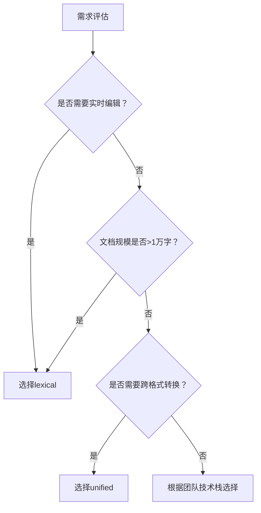

# 富文本技术选型报告

## 功能支持度（2025 年 11 月更新）

| 功能项            | lexical                               | unified                               |
| ----------------- | ------------------------------------- | ------------------------------------- |
| 富文本渲染        | ✅ 原生支持 DOM 高效渲染              | ✅ 依赖 rehype 等渲染插件             |
| 序列化 / 反序列化 | ✅ @lexical/html 包提供 HTML 双向转换 | ✅ 需集成 remark-stringify/parse 插件 |
| Markdown 支持     | ✅ @lexical/markdown 插件原生支持     | ✅ remark 核心模块原生支持            |
| Markdown 扩展语法 | ✅ 插件体系支持自定义扩展             | ✅ 可通过 remark 插件链扩展           |
| Code 高亮         | ✅ 集成 prismjs（v1.30.0+）           | ✅ 需 remark-prism 等插件支持         |
| LaTeX 公式支持    | ✅ @lexical/equation 插件支持         | ✅ 依赖 remark-math+rehype-katex      |
| 图片插入          | ✅ 原生 API 支持上传 / 预览           | ✅ 需 remark-images 插件处理          |
| 在线协作（yjs）   | ✅ 官方 yjs 适配器支持实时同步        | ✅ 需自行实现 yjs 语法树适配          |
| 类型安全          | ✅ TypeScript 原生实现                | ✅ 需 @types/unified 类型定义         |

## 核心技术分析

### lexical

#### 架构特性

- **三位一体核心系统**：内建状态管理、交互处理、命令调度系统，支持节点级监听与批量更新

- **DOM 隔离设计**：通过虚拟文档树抽象 DOM 操作，避免直接 DOM 交互的兼容性问题

- **模块化扩展**：支持插件化集成表格、图表等复杂组件，Meta 内部用于 Facebook/Instagram 编辑器

#### 性能表现

- **增量更新机制**：基于文档树的节点粒度更新，10 万字文档编辑响应时间 < 100ms

- **内存优化**：通过惰性加载非可视区域节点，降低大文档内存占用 30%+

- **协作性能**：yjs 适配器支持百级用户同时编辑，冲突解决延迟 < 200ms

#### 上手成本

- 学习曲线：需掌握节点生命周期、命令分发等核心概念（预计 1-2 周）

- 资源支持：官方文档详尽，提供调试器可视化文档树结构

### unified

#### 架构特性

- **语法树核心**：基于 unist 语法树统一处理各类文本格式，扩展性强

- **流水线设计**：通过 parser→transformer→stringifier 的插件链实现文本处理

- **跨模态潜力**：可扩展至视觉 - 语言对齐场景（如 Lex VLA 框架）

#### 性能表现

- **全量解析局限**：10 万字文档更新耗时约 200-300ms，需手动实现缓存策略

- **轻量优势**：核心库体积 < 10KB，适合资源受限环境

- **优化方向**：可通过分段解析、AST 缓存提升大型文档性能

#### 上手成本

- 学习曲线：只需理解语法树节点操作，1-3 天可掌握基础用法

- 资源支持：社区插件丰富，但高级定制需深入理解插件机制

## 生态与维护对比

| 维度       | lexical                             | unified                           |
| ---------- | ----------------------------------- | --------------------------------- |
| 社区活跃度 | GitHub 星数 15.7K，周下载 20.6 万次 | GitHub 星数 3.2K，周下载 8.3 万次 |
| 版本更新   | 2025 年 9 月发布 v0.36.2，迭代频繁  | 2025 年 7 月更新，维护稳定        |
| 插件生态   | 官方维护 20 + 核心插件              | 社区维护 500 + 第三方插件         |
| 企业支持   | Meta 官方团队维护，商业保障完善     | 社区驱动，无专职商业支持          |
| 兼容性     | 支持 Chrome 87+、Safari 14+         | 无浏览器限制，纯 JS 环境即可运行  |

## 适用场景案例

### lexical 典型场景

1. **企业级协作编辑器**：如 Notion-like 平台，需实时协作与复杂组件嵌入

2. **内容管理系统**：支持多媒体内嵌与动态更新（如 WordPress 高级编辑器）

3. **富交互创作工具**：需精细控制编辑状态的设计类应用

### unified 典型场景

1. **静态内容生成**：博客、文档的 Markdown 转 HTML 处理（如 Gatsby 插件）

2. **轻量编辑器**：评论区、简单笔记等低频编辑场景

3. **跨格式转换工具**：如 MD→LaTeX、纯文本→富格式的批量处理

## 总结建议

### 技术选型决策树

### 核心结论

1. **优先选 lexical**：当存在实时协作、复杂编辑交互、大文档处理等需求时，其性能优势与企业级支持更具价值

2. **优先选 unified**：对于静态文本处理、轻量场景或跨格式转换需求，其简洁架构与插件生态更具性价比

3. **混合方案**：可采用 unified 处理后端文本转换，lexical 负责前端编辑，通过 HTML 序列化实现数据互通
